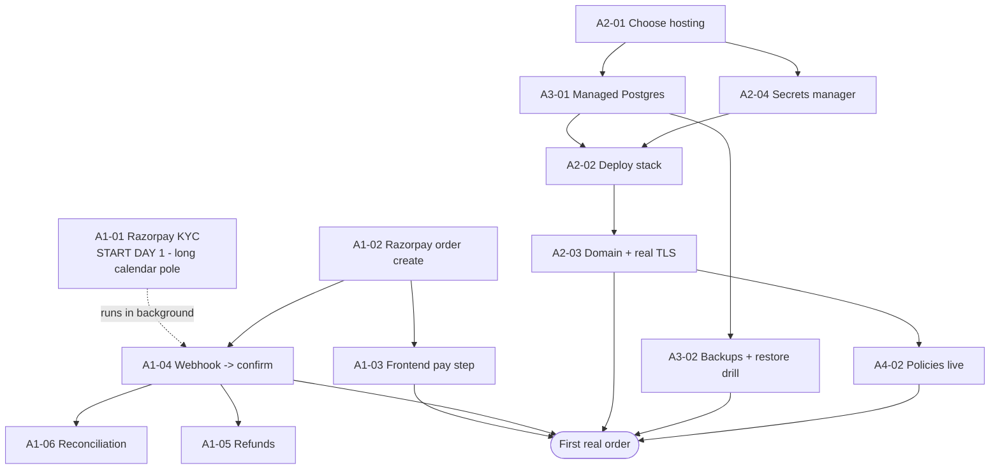

# Phase A — "Make it sellable" — Ticket Breakdown

*Goal: convert the verified prototype into a store that can take a **real order with real money on a real website**. These are the hard blockers from the product report, broken into concrete, estimable tickets.*

**Phase target:** first real order accepted, end-to-end.
**Rough total effort:** ~3–4 weeks engineering + payment-provider KYC (calendar time, started in parallel).
**Legend:** 🔴 blocker · ⏱ estimate · ✅ acceptance criteria · 🔗 depends on

---

## Epic A1 — Real Payments (Razorpay)

> Replace the simulated payment service with a real provider so money actually moves. Razorpay chosen for India-first coverage (UPI, cards, netbanking).

### A1-01 · Razorpay merchant account + KYC 🔴
**What:** Open a Razorpay business account; complete KYC (PAN, GST, bank account, business proof).
⏱ 0.5 day of work + **3–10 business days** of Razorpay review (start this first — it's the long calendar pole).
✅ Live API keys issued; settlement bank account verified.
🔗 none — **do this on day one.**

### A1-02 · Integrate Razorpay order creation in `payment-service` 🔴
**What:** Replace the mock charge with a real Razorpay **Order create** call. The service returns the Razorpay order id + amount to the checkout flow.
⏱ 3 days
✅ `payment-service` creates a real Razorpay order; amount/currency match the cart total; keys read from the secrets manager (not hard-coded).
🔗 A1-01

### A1-03 · Frontend payment step (Razorpay Checkout) 🔴
**What:** Add the Razorpay Checkout widget to the storefront checkout — shopper enters card/UPI, completes payment in the widget.
⏱ 2 days
✅ Shopper can pay with a test card/UPI in test mode; success returns a payment id to our backend.
🔗 A1-02

### A1-04 · Payment webhook → confirm/settle the order 🔴
**What:** Listen for Razorpay's `payment.captured` / `payment.failed` webhooks; verify the webhook **signature**; advance the order saga to CONFIRMED (or FAILED → release stock).
⏱ 2–3 days
✅ A real captured payment flips the order to CONFIRMED via the existing saga; a failed/abandoned payment releases the inventory reservation; webhook signature is verified (rejects forged calls).
🔗 A1-02 · 🔗 existing saga (already built)

### A1-05 · Refund path 🔴
**What:** Wire the saga's existing compensation/cancel hook to a real Razorpay **refund** call.
⏱ 2 days
✅ Cancelling/refunding an order issues a real refund and records it; idempotent (no double refund).
🔗 A1-04

### A1-06 · Daily reconciliation job
**What:** Scheduled job comparing our `order`/`payment` records against Razorpay's settlement report; flag mismatches.
⏱ 2 days
✅ A daily report lists any order whose payment state disagrees with Razorpay; zero mismatches on a clean day.
🔗 A1-04

**Epic A1 subtotal: ~11–12 dev days (+ KYC calendar time).**

---

## Epic A2 — Live Hosting + Domain + Real TLS

> Move from "runs on a laptop with a self-signed cert" to "reachable on the public internet with a browser-trusted certificate."

### A2-01 · Choose & provision hosting 🔴
**What:** Pick the target (recommendation: a managed PaaS like Railway/Render, or a single cloud VM) and provision it. Avoid Kubernetes for now — premature for first-order scale.
⏱ 1 day (decision) + 0.5 day provision
✅ An environment exists that can run the compose stack (or its deployed equivalent).
🔗 none

### A2-02 · Deploy the stack to hosting 🔴
**What:** Deploy the 7 services + backing infra to the chosen host; wire service-to-service networking; point config at managed Postgres (A3-01) and the secrets manager (A2-04).
⏱ 3–4 days (first deploy is always the longest)
✅ The full stack runs on the host; the smoke test (16 checks) passes against the deployed URL.
🔗 A2-01 · 🔗 A3-01 · 🔗 A2-04

### A2-03 · Domain + CA-signed TLS at the edge 🔴
**What:** Register/point a domain; issue a real certificate (Let's Encrypt or provider-managed) terminating at the gateway, replacing the dev self-signed cert.
⏱ 1 day
✅ `https://<domain>` loads with a green padlock (no browser warning); HTTP redirects to HTTPS.
🔗 A2-02

### A2-04 · Secrets manager 🔴
**What:** Move secrets out of the local `.env` (`gen-secrets.sh`) into a real manager (AWS Secrets Manager / Doppler / provider env-vars). DB password, JWT secret, Razorpay keys, TLS keystore password.
⏱ 1 day
✅ No secret is committed or sits in a plaintext file on the host; services read secrets at boot from the manager.
🔗 A2-01

**Epic A2 subtotal: ~6–7 dev days.**

---

## Epic A3 — Managed Database + Backups

> Stop running the database in a throwaway container; make data durable and recoverable.

### A3-01 · Managed Postgres 🔴
**What:** Provision a managed Postgres (RDS / Cloud SQL / provider DB); run the Flyway migrations against it; point all 5 data services at it.
⏱ 1 day
✅ All services boot against managed Postgres; migrations applied; smoke test green.
🔗 A2-01

### A3-02 · Automated backups + tested restore 🔴
**What:** Enable automated daily backups + point-in-time recovery; **perform one real restore drill** (untested backups don't count).
⏱ 1 day
✅ Daily backups confirmed; a restore into a scratch instance succeeds and the data is intact.
🔗 A3-01

**Epic A3 subtotal: ~2 dev days.**

---

## Epic A4 — Go-live compliance (parallel, calendar-bound)

> Not code, but legally gates payment go-live. Start alongside A1.

### A4-01 · Business + payment KYC
Covered operationally by A1-01.

### A4-02 · Policies: privacy, terms, returns/refunds 🔴
**What:** Publish a privacy policy, terms of service, and a return/refund policy (Razorpay requires these live before activating real payments).
⏱ 1–2 days (often using counsel/templates)
✅ All three pages are live and linked in the storefront footer.
🔗 A2-03

### A4-03 · Category licensing (if applicable)
**What:** If selling regulated goods (e.g. food → FSSAI), obtain the licence. Skip if not applicable to the launch catalogue.
⏱ calendar-bound (external)
✅ Required licence in hand before listing regulated products.

---

## Suggested execution order (critical path)

**The "first real order" gate is met when:** a shopper visits the real domain (green padlock), adds an item, pays with a real card/UPI, the order is CONFIRMED via the verified saga, the data lives in managed Postgres with backups, and the legal policies are published.

---

## Ticket summary

| ID | Title | 🔴 | ⏱ days |
|---|---|---|---|
| A1-01 | Razorpay account + KYC | 🔴 | 0.5 + review |
| A1-02 | Razorpay order create | 🔴 | 3 |
| A1-03 | Frontend pay step | 🔴 | 2 |
| A1-04 | Payment webhook → confirm | 🔴 | 2–3 |
| A1-05 | Refund path | 🔴 | 2 |
| A1-06 | Reconciliation job | | 2 |
| A2-01 | Choose + provision hosting | 🔴 | 1.5 |
| A2-02 | Deploy stack | 🔴 | 3–4 |
| A2-03 | Domain + real TLS | 🔴 | 1 |
| A2-04 | Secrets manager | 🔴 | 1 |
| A3-01 | Managed Postgres | 🔴 | 1 |
| A3-02 | Backups + restore drill | 🔴 | 1 |
| A4-02 | Policies live | 🔴 | 1–2 |
| A4-03 | Category licensing | | external |

**Total: ~22–25 engineering days (~3–4 calendar weeks for one engineer), gated by Razorpay KYC review time — which is why A1-01 starts on day one.**

*What we're NOT redoing: the checkout saga, idempotency, no-oversell/no-double-charge logic, RBAC, rate-limiting, and the CI quality gate are already built and verified. Phase A is integration + operations, not core architecture.*
