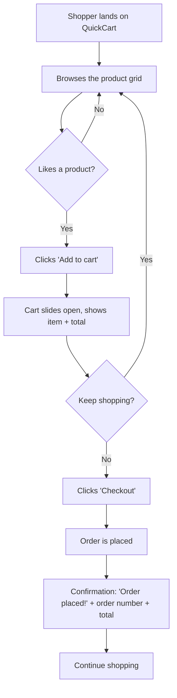
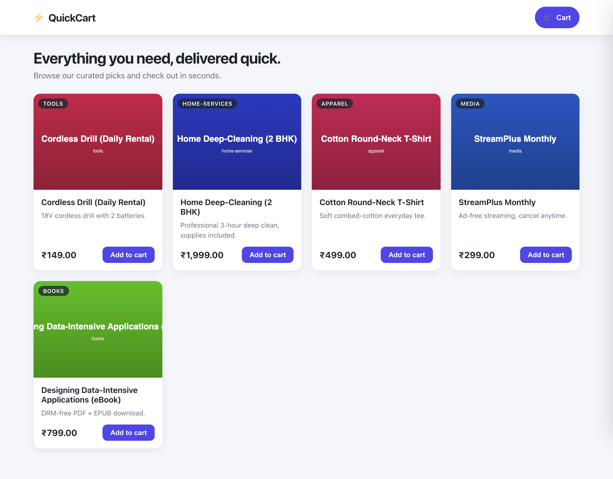
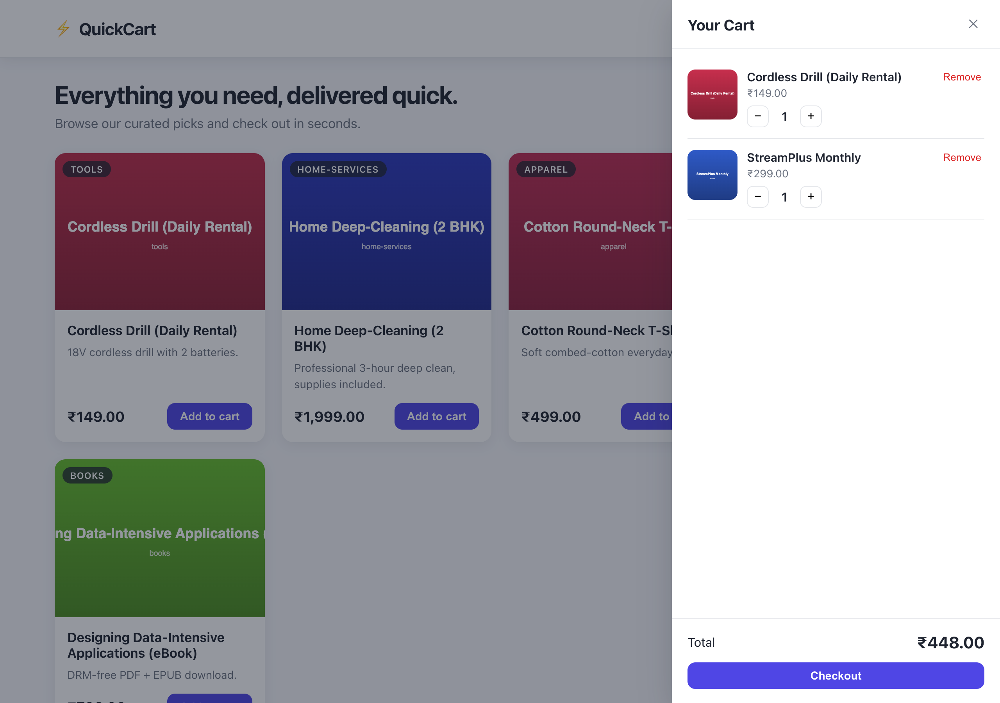
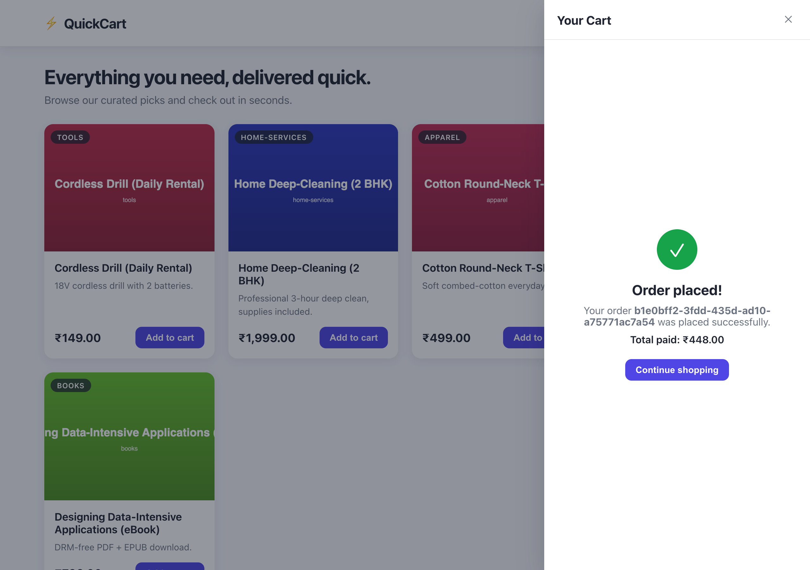
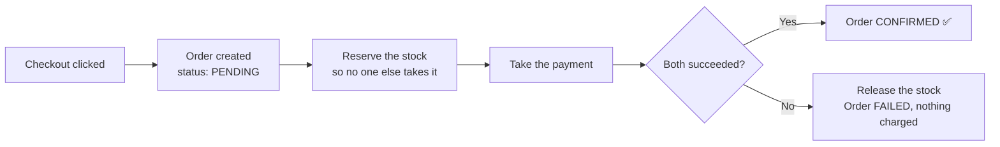
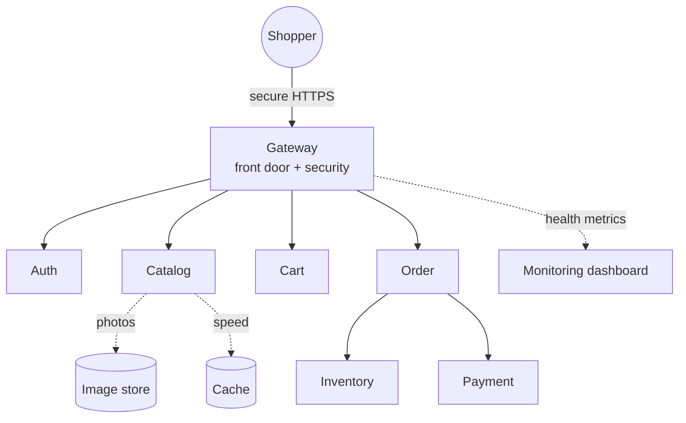
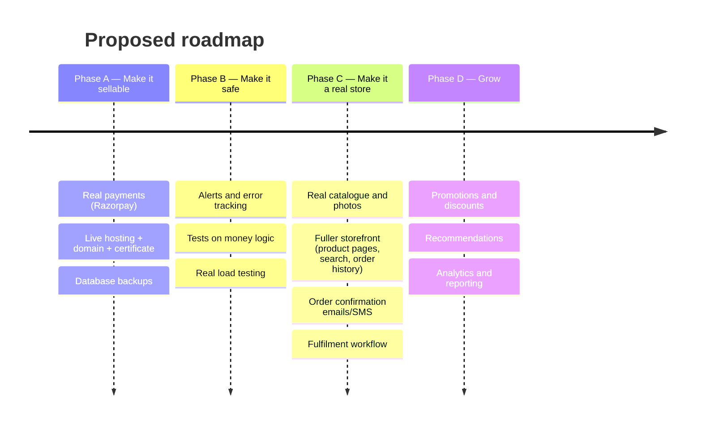

# QuickCart — Product Status Report

*A plain-English walkthrough of what's been built, for the product team. No engineering background needed.*

**Prepared:** June 2026 · **Stage:** Working prototype (MVP), running end-to-end · **Audience:** Product / business stakeholders

> **This report uses real visuals:** the ```mermaid``` blocks render as flow diagrams on GitHub / any Markdown previewer, and the UI screens are **actual screenshots** captured from the running application (`docs/screenshots/`).

---

## 1. The one-paragraph summary

We have a **working online store** — call it **QuickCart** — where a shopper can land on the site, browse products, add them to a cart, and check out, with the order confirmed and saved reliably. Behind the scenes it's built the way large retailers build (lots of small, independent services instead of one big program), so it can grow without being rebuilt. The **shopping experience works today**; what's missing before real customers and real money are the *operational* pieces (a real payment company, a live website address, polish, and safety nets) — covered in Section 7.

**Think of it as:** the engine, chassis, and a test-drive-ready body of a car are built and verified. It hasn't been registered, insured, or given its final paint — but it drives.

---

## 2. What a shopper can do today

| Capability | Status | What it means for the customer |
|---|---|---|
| Browse a product catalogue | ✅ Done | A grid of products with photos, descriptions, categories, and prices |
| Start shopping instantly (no signup) | ✅ Done | A "guest" session is created automatically — no friction to start |
| Sign in with Google | ✅ Done | Optional account login for a saved identity |
| Add / remove / change quantity in cart | ✅ Done | A slide-out cart that updates live |
| Check out and place an order | ✅ Done | One button; order is confirmed and saved |
| Get an order confirmation | ✅ Done | Order number + total shown immediately |
| Order survives a system restart | ✅ Done | Once placed, an order is never lost |
| **Pay with a real card / UPI** | ❌ Not yet | Payment is currently *simulated* (no real money moves) |

The catalogue already supports **five different kinds of products** — physical goods (a T-shirt with S/M/L sizes), digital downloads (an eBook), services (home cleaning), subscriptions (streaming), and rentals (a power drill). That flexibility is built in from day one.

---

## 3. The shopper's journey (the whole flow)



Every step above works in the live prototype today. Here is what each screen actually looks like:

### Screen 1 — Storefront (the landing + browse page)



*Live capture: the ⚡ QuickCart header with cart, the hero banner, and the catalogue grid showing the five curated products (T-shirt, eBook, deep-cleaning service, streaming subscription, drill rental) with category badges, prices in ₹, and "Add to cart".*

### Screen 2 — Cart (slides in from the right when you add an item)



*Live capture: the slide-in cart with two items (Cordless Drill ₹149 + StreamPlus ₹299), per-line quantity controls and Remove, a running total of ₹448, and the one-click Checkout button.*

### Screen 3 — Order confirmation (after checkout, in the same panel)



*Live capture of a **real end-to-end checkout**: the order settled through the checkout saga and returned a genuine order id, "Order placed!", and "Total paid: ₹448". This is the actual working flow, not a mockup.*

> Today there are **three screens** (browse, cart, confirmation) — deliberately minimal for the prototype. A fuller storefront (individual product pages, search, order history, account area) is a planned next phase.

---

## 4. What happens "behind the curtain" at checkout (in plain English)

When a shopper clicks **Checkout**, money and stock are involved, so we built this to be *bullet-proof against the classic online-store failures*: charging twice, selling something that's out of stock, or losing an order if a server hiccups.



The three guarantees this gives the business:

- **No double charges.** If a shopper double-clicks or the network blips and the request is sent twice, the system recognises it's the *same* order and charges only once. *(Done via an "idempotency key" — a unique fingerprint per checkout.)*
- **No overselling.** Stock is *reserved* before payment, so two people can't buy the last item. If payment fails, the reservation is released automatically.
- **No lost orders.** Once an order is recorded it survives a full system restart — we tested exactly this (turned everything off and on; the order was still there).

This is the part that's genuinely "production-grade" already — the hard, money-critical logic is done and verified.

---

## 5. Behind the scenes: how it's built (the 30-second version)

The store is made of **seven small specialist services** instead of one big program. Each does one job and can be updated, scaled, or fixed without touching the others:

| Service | Its job (in shop terms) |
|---|---|
| **Gateway** | The front door & security guard — everything enters here |
| **Auth** | Issues "visitor passes" (guest sessions / Google login) |
| **Catalog** | The product shelves (names, prices, photos) |
| **Cart** | The shopping basket |
| **Inventory** | The stockroom (what's available, reservations) |
| **Order** | The checkout counter & receipts |
| **Payment** | The card machine *(currently a demo unit — no real money)* |

Plus supporting infrastructure: a database (permanent records), a fast cache (speed), an image store (product photos), and a **live monitoring dashboard** (Grafana) showing the store's health in real time.



---

## 6. Security & safety already in place

These matter to a non-technical audience because they're the difference between "a demo" and "something you can responsibly put customers on":

- 🔒 **Encrypted connection** — traffic is protected (HTTPS) at the front door.
- 👮 **One guarded entrance** — shoppers can never talk to internal services directly; everything goes through the gateway, which checks every visitor's pass.
- 🛡️ **Admin vs shopper roles** — only approved admin accounts can change products or stock; a normal shopper is blocked (enforced in two places for safety).
- 🚦 **Abuse protection** — automatic rate-limiting stops a single source from hammering the store.
- 🧹 **Security-scanned** — the code is automatically scanned for known vulnerabilities on every change, and currently passes with **zero critical issues**.
- ✅ **Automated quality gate** — every change is automatically built, smoke-tested (16 checks), and security-scanned before it can be accepted.

---

## 7. What's NOT done yet — the honest "path to live"

The shopping experience works, but these stand between the prototype and a real, public, money-taking store. Grouped by priority:

### 🔴 Hard blockers (cannot sell to a real customer without these)
| Item | Why it's a blocker | Rough effort |
|---|---|---|
| **Real payment provider** (e.g. Razorpay) | Today payment is simulated — no real money can be taken | ~1.5–2 weeks |
| **Live website + proper security certificate + domain** | Currently runs only on a developer's machine with a self-signed (browser-rejected) certificate | ~1 week |
| **Proper hosting + database backups** | Everything runs on one machine; if it dies, data is at risk | ~3–4 days |

### 🟠 Strongly needed (would launch fragile without these)
| Item | Why it matters | Rough effort |
|---|---|---|
| **Alerts when something breaks** | We collect health data but nothing pages us at 2am | ~2 days |
| **Automated tests on money logic** | The safety net is currently one broad test, not detailed ones | ~4–5 days |
| **Real product data & photos** | Catalogue is sample data | ~2–3 days |
| **Fuller, customer-grade storefront** | Current UI is functional, not yet "sellable" polish | ~1 week+ |

### 🟢 Compliance / business (start early — these take calendar time, not just dev time)
- Payment-provider business verification (KYC)
- Privacy policy, terms, return/refund policy (required before payment go-live)
- Any category-specific licensing (e.g. food/FSSAI) if relevant to the products sold

**Realistic timeline to a first real order:** ~4–6 weeks of focused work **plus** payment-provider approval time. Add ~2 weeks of safety nets to launch *without regret*.

---

## 8. Suggested next phases (for us to discuss)



**Recommended first move:** Phase A. It converts a verified prototype into something that can take a real order — the single biggest jump in business value.

---

## Appendix — about the screenshots

The three UI images in Section 3 are **real screenshots** captured from the running application on 9 June 2026: the full stack (all 12 containers) was started locally, the React storefront served, and an automated browser walked the actual flow — browse → add to cart → checkout — capturing each screen. The confirmation screen shows a genuine order id from a checkout that settled through the real saga. Source images live in `docs/screenshots/`.

*Source of truth for everything above: the running codebase as of June 2026. Nothing in this report is aspirational — every "✅ Done" item works in the current build.*
