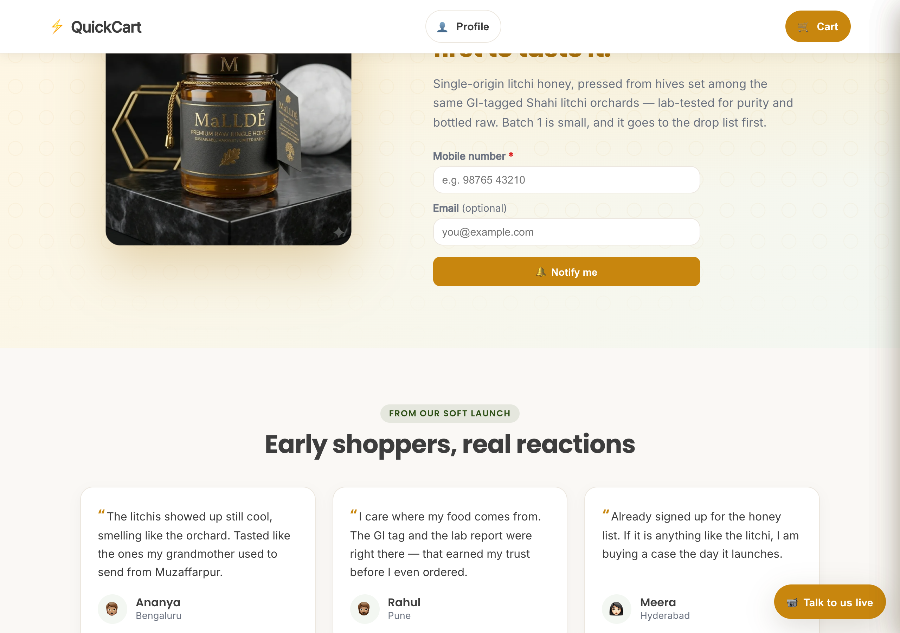
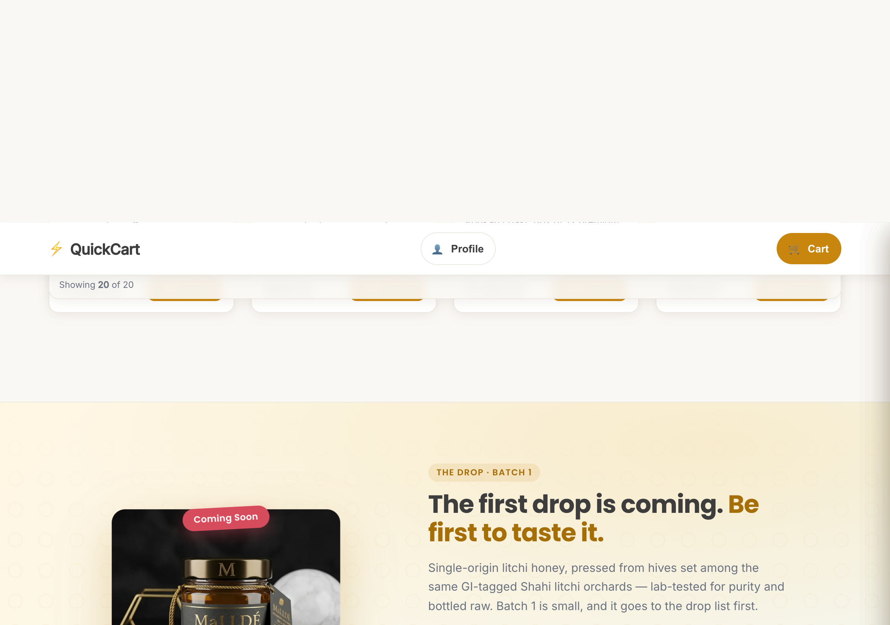

# Honey "The Drop" — Coming-Soon launch moment

> Reference for the honey pre-launch surface. Shipped to `main` in PR #39 (squash `11dfce2`,
> 12 Jun 2026). Direction **A "The Drop"** (no-date variant), chosen from a 3-direction design round.

The honey SKUs are **never buyable**. They are the storefront's one real pre-launch conversion event:
every honey touchpoint funnels to a single launch list (`POST /api/catalog/notify`, topic `honey`),
framed as a Gen-Z product "drop."

---

## Honey teaser (homepage section)

- Real MaLLADE honey jar (`/updates/honey.jpg`) on the warm honeycomb/marble backdrop — no placeholder.
- Drop-voice copy: headline **"Be first to taste it"**, body *"Single-origin litchi honey, pressed
  from hives set among the same GI-tagged Shahi litchi orchards — lab-tested for purity and bottled
  raw. Batch 1 is small, and it goes to the drop list first."*
- Notify form: **Mobile number (required)** + Email (optional) → honey **Notify me** CTA.
- *(In this capture the headline's top edge is clipped by the scroll position.)*

## Honey product card (catalogue)

- "Coming Soon" treatment + **"Join the drop list"** CTA (never add-to-cart).
- Same real jar image and drop framing as the teaser — one coherent surface across card + teaser + modal.

---

## The signup count is NOT shown to customers (founder decision)

- Earlier the storefront teased a *"N already in line"* social-proof count. The founder removed it: the
  honey CTA is now **always a plain "Notify me"**, with no count anywhere on the storefront. The old
  `honeyInLineCount()` / `HONEY_INLINE_FLOOR` machinery has been retired from the customer side.
- The aggregate is still available **internally**: a public, read-only `GET /api/catalog/notify/count?topic=honey`
  → `{ topic, count }` exists for the founder/admin (it leaks no PII — just an integer + the topic key).
  It is intentionally **not wired to any customer UI**; surfacing it in the admin app is an optional later step.

## The countdown clock (deferred, behind a seam)

- `HONEY_LAUNCH_DATE` in `frontend/src/lib/comingSoon.ts` is currently `null` → the no-date "The Drop"
  copy you see above.
- **Set it to an ISO date** when a real litchi-honey launch date is locked → flips on the countdown
  path (currently a minimal stub; full clock styling is the remaining work for that branch).

## Invariants preserved (verified live against the served container)

- **honey-not-buyable** — served bundle has exactly one `Add to cart` string (the non-honey branch);
  honey routes only to the drop CTA. `isComingSoon(p)` ⟺ `category==='honey'`.
- **one launch list** — all three touchpoints write via `saveNotify('honey')` + `notify('honey')`.
- Tokens only (`var(--honey)` etc.), no backend change. Full-stack e2e smoke: **68 passed / 0 failed**.

> Note: honey-not-buyable is a **UI guarantee** — `POST /api/cart/items` still accepts honey at the
> API. Airtight for real users through the storefront; add a server-side cart-service reject if it must
> be enforced before public launch.

---

## Files

| File | Role |
|------|------|
| `frontend/src/components/HoneyTeaser.tsx` | homepage teaser (drop voice + gated count + date seam) |
| `frontend/src/components/ProductCard.tsx` | honey card "Join the drop list" branch |
| `frontend/src/components/ComingSoonModal.tsx` | "The first drop is coming 🍯" signup modal |
| `frontend/src/lib/comingSoon.ts` | `HONEY_LAUNCH_DATE`, `HONEY_INLINE_FLOOR`, `honeyInLineCount()` |
| `frontend/src/index.css` | `.honey-drop-eyebrow`, `.honey-inline-count`, `.honey-teaser-count`, `.honey-teaser-countdown` |

*Screenshots captured from the served container, 12 Jun 2026.*
